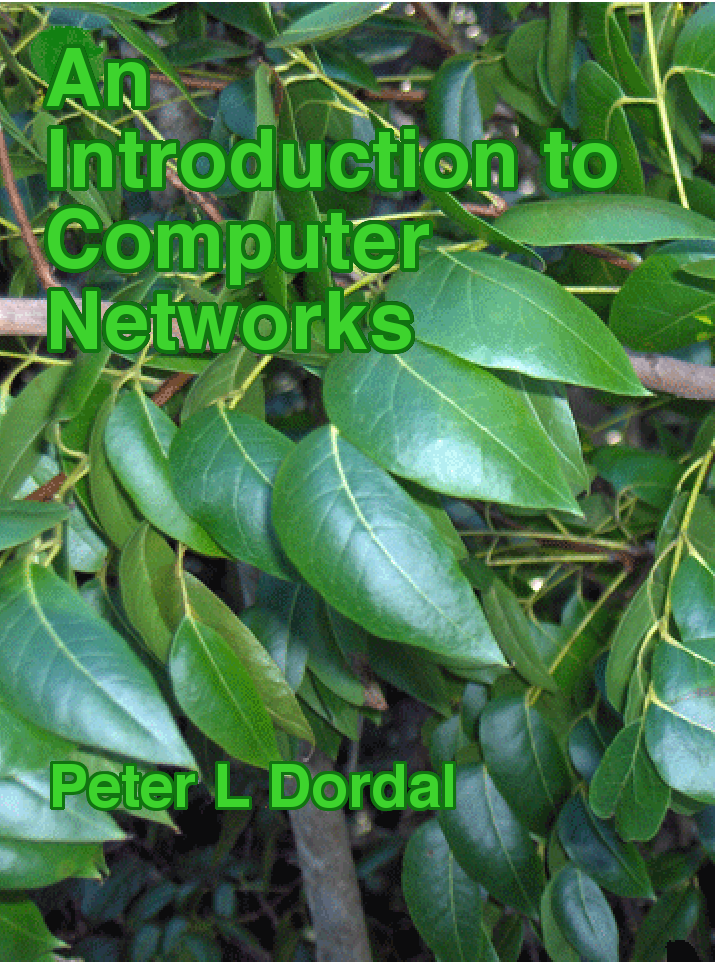

For CSC 525 course (Principles of Computer Networking) taught by Beichuan Zhang during Fall 2021 (graduate @ UArizona), we built a software router that ran over the network topology provided by the [Virtual Network Lab](https://github.com/gkorpal/VNL) hosted on a Ubuntu 14.04 server.  However, I can't share the sourcecode of the project since the same assignment is given every year. Therefore, in the subfolders above, I have shared a description of what we did for the projects. 

Topics covered during the course:
* Design philosophy of IP (packet switching, dynamic routing, hourglass design, and End-to-End argument)
* Intra-domain routing (RIP -- Loop Free Path Finding Algorithm; and OSPF -- D-SPF and HN-SPF)
* Inter-domain routing (BGP -- damping, routing policy, peering, network topology, Power-Laws, prefix hijacking, ...)
* IP multicast (IGMP, DVMRP, MOSPF, CBT, PIM-SM)
* Congestion control (TCP and XCP)
* Infrastructure applications (DNS)
* Overlay networks (RON, Multicast -- Narada, DHT -- Chord, P2P -- BitTorrent, CDN -- YouTube)
* Ethernet alternatives for enterprise networks (SEATTLE and PortLand DCN)
* Software defined networks (OpenFlow, Google B4)
* Future internet (IPv6 and NDN)

The reference texts I used (click on the images to visit their websites):

    
  
   

 

**Equivalent courses:** [CS144 @ Stanford](http://www.scs.stanford.edu/09au-cs144/) | [COS461 @ Princeton](https://www.cs.princeton.edu/courses/archive/spr14/cos461/index.html) | [CS118 @ UCLA](http://web.cs.ucla.edu/classes/spring17/cs118/) | [CSE123 @ UCSD](https://cseweb.ucsd.edu/classes/fa14/cse123-a/) | [COMPSCI356 @ Duke](https://courses.cs.duke.edu/compsci356/spring14/index.html) | [CMSC23320 @ UChicago](https://uchicago-cs.github.io/cmsc23320/index.html).
